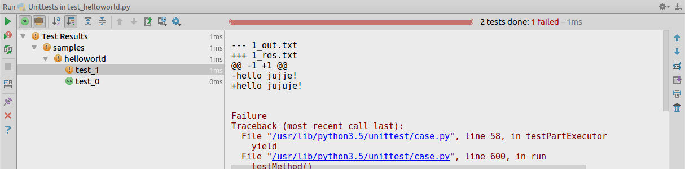

Judge Offline for Python3
===========================================================

Simple module to help testing programming contest exercises.

It aims to help me resolve some problems I have with online platforms:
- you have to be online
- if the platform disappears you lost your work
- if you use multiple platforms the problems you solved are not centralized
- you can't manage personal problems you've taken from book or other sources

Usage
-----

Create your problem solution by first creating a folder like the
one present in the samples folder.

     ─ helloworld
       ├── 0_in.txt
       ├── 0_out.txt
       ├── 0_res.txt
       ├── 1_in.txt
       ├── 1_out.txt
       ├── 1_res.txt
       ├── helloworld.py
       ├── __init__.py
       └── test_helloworld.py

The _helloworld.py_ file contains your problem solution
```python
w = input()
print("hello " + w + "!")
```

The _test_helloworld.py__ simply contains:
```python
from judge_offline import *

tests = create_test_class('samples.helloworld')
```

A test is described via 3 files:
 - input which is given to the standard input to the solution. Must be suffixed with __in.txt_
 - output which is produced by the solution. Must be suffixed by __out.txt_
 - result which contains expected result. Must be suffixed  by __res.txt_

Simply run the unit test to run all tests described into files.



When a test fails the diff between expect result file and output file is shown (up to a fixed limit).

Installation
------------
```bash
python setup.py install
```